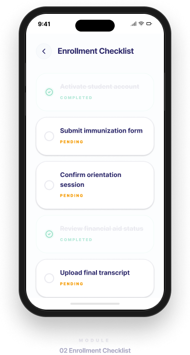

# Lilo Chatbot 项目案例
**对话式 AI｜大模型产品思维｜Agent 体验设计｜用户研究**

> 本仓库是 Lilo 项目的作品集案例展示（portfolio case study），用于呈现我在对话式 AI、用户研究与 Agent 体验设计方面的思考与能力。
## 项目简介
Lilo 是一个面向大学入学阶段学生的短信式聊天机器人，目标是帮助学生顺利完成大学入学流程，并减少 “summer melt” 现象，也就是学生虽然已经被大学录取，但最终没有顺利入学的情况。

从 AI 产品的角度来看，Lilo 不只是一个普通问答工具，它更像是一个面向真实用户场景的 **大模型驱动对话系统**。它需要理解不同类型的用户意图，处理模糊输入，在提供信息支持的同时建立信任，并在必要时进行引导或转接。

这个项目展示的是我基于自己在加州大学欧文分校相关研究与实践经历，对 **对话式 AI、用户需求、任务流程与 Agent 体验设计** 的系统性思考。我将它整理为一个适合放入 GitHub 作品集的项目案例，用于呈现自己在 **AI 产品设计、对话系统思维、用户研究与体验优化** 方面的能力。

## 项目链接
- 官方网站：<https://daplab.education.uci.edu/lilo>

## 我的角色
在这个项目中，我主要从 **AI 产品与对话体验设计** 的视角进行分析与整理，重点包括：

- 梳理 Lilo 所服务的核心用户群体与使用场景
- 拆解入学阶段学生的高频问题与任务路径
- 从对话式 AI 的角度分析其交互逻辑与体验挑战
- 总结该项目与 **LLM、AI Agent、RAG、用户研究** 的关联
- 将项目包装为更适合求职展示的 GitHub 项目案例

## 项目背景
大学在录取学生之后，仍然面临一个关键问题：部分学生虽然已经确认录取，但由于材料、沟通、经济、心理压力或信息不对称等原因，最终没有完成正式入学流程。这一现象通常被称为 **summer melt**。

Lilo 这样的聊天机器人，正是为了解决这一问题而设计。相较于传统网页信息、邮件通知或 FAQ 页面，短信式聊天机器人更贴近学生日常沟通习惯，能够在更自然、更轻量的互动中提供提醒、支持与指引。

这也意味着，Lilo 不能只是“回答问题”，而需要在真实场景中承担更多角色：
- 信息提供者
- 流程引导者
- 情绪缓冲者
- 必要时的人机协作入口

## 项目目标
从产品与体验设计的角度来看，这个项目的核心目标包括：

- 帮助学生更顺利地完成入学前关键流程
- 提高学生对学校信息、时间节点与任务要求的理解
- 通过更自然的对话方式降低信息门槛与焦虑感
- 在需要时为用户提供下一步操作建议或转接支持
- 通过更高质量的沟通方式降低 summer melt 风险

## 项目挑战
这个项目的难点并不只是“做一个 chatbot”，而是在于如何让系统真正适应真实世界中的复杂用户需求。主要挑战包括：

- 学生的问题类型多样，既包括明确的信息查询，也包括模糊、零散甚至情绪化的表达
- 用户往往并不知道自己下一步应该做什么，因此系统不仅要回答，还要引导
- 入学流程涉及多个时间节点、材料要求与学校规则，信息准确性非常重要
- 机器人回复不能过于机械，否则会影响信任感与使用意愿
- 并非所有问题都适合自动化处理，系统需要在合适的时候转接人工支持

## 与 AI Agent / 大模型的关联
这个项目之所以适合放在 AI 相关作品集中，是因为它不仅是一个教育场景工具，也体现了我对 **大模型应用、Agent 逻辑与检索增强思维** 的理解。

### 1. 与 LLM 的关联
Lilo 的核心交互建立在自然语言理解与生成能力之上。用户不会总是以标准化、结构化的方式表达问题，因此系统需要：
- 理解自然语言输入
- 识别模糊或不完整意图
- 在上下文中生成更自然、可持续对话的回复

这类需求本质上与大语言模型的能力高度相关。

### 2. 与 AI Agent 的关联
从产品逻辑上看，Lilo 不只是“一问一答”的工具，而更接近一个具备任务导向能力的对话式 Agent。它需要根据用户所处阶段和问题状态，动态决定下一步动作，例如：
- 继续澄清问题
- 提供对应流程说明
- 给出下一步提醒
- 在必要时引导转接人工支持

这体现的是 **面向目标的多轮交互设计思维**，也是我对 Agent 体验设计特别感兴趣的方向。

### 3. 与 RAG 的关联
如果将 Lilo 与学校真实的知识库、政策说明、时间节点、入学 FAQ 等内容连接，它就非常适合采用 **RAG（Retrieval-Augmented Generation，检索增强生成）** 的方式来优化体验。这样可以：
- 提高回复准确性
- 降低幻觉风险
- 让回答更贴近真实学校流程
- 增强用户对系统的信任感

因此，这个项目也体现了我对 **LLM + 检索 + 任务场景结合** 的产品思考。

## 设计过程
### 1. 用户与场景理解
Lilo 面向的是即将入学的新生群体。这个阶段的用户通常会遇到很多现实问题，例如：
- 不清楚入学前必须完成哪些任务
- 对时间节点、材料要求或流程顺序理解不足
- 在面对新环境时容易焦虑或拖延
- 不知道应该联系谁、去哪里获取帮助

因此，这个产品的核心不是“展示信息”，而是让学生在对话中更容易获得理解、支持与行动方向。

### 2. 任务拆解
从用户任务出发，可以将 Lilo 支持的内容理解为几类典型场景：
- 查询入学流程与材料要求
- 获取关键时间提醒
- 理解下一步该做什么
- 在不确定时请求澄清
- 在遇到复杂问题时寻求更进一步支持

通过这种任务拆解，可以更清楚地设计对话逻辑，而不只是简单堆叠回答内容。

### 3. 对话体验设计思考
一个好的对话系统，不只是“回答正确”，还要“让人愿意继续使用”。因此在体验层面，我特别关注以下问题：

- 回复是否足够清晰，而不是信息堆积
- 语气是否友好可信，而不是机械命令式
- 是否能帮助用户理解下一步动作
- 是否能在模糊输入下维持对话连续性
- 是否能在需要时识别边界并引导人工支持

这些考虑反映了我对 **对话体验设计、用户信任建立与 AI 产品细节** 的关注。

### 4. 评估与优化思维
如果把这个项目放在更完整的 AI 产品框架中，我会关注以下评估维度：
- 用户是否更容易完成关键任务
- 回复是否准确、清晰、一致
- 系统是否能有效处理模糊问题
- 用户是否知道下一步该做什么
- 对话是否具有支持感，而不只是信息输出

这也体现了我对 **LLM 输出评估、用户体验评估与产品迭代** 的兴趣。

## 我的主要贡献（作品集表达）
在这个 GitHub 项目案例中，我将自己的贡献重点总结为以下几个方向：

- 从用户视角分析 Lilo 在大学入学阶段的实际使用价值
- 以产品思维拆解对话系统中的核心任务与体验问题
- 将项目与 **AI Agent、LLM、RAG、用户研究** 等概念建立联系
- 通过案例化表达，把一个教育技术项目整理成更适合招聘展示的 AI 产品作品集
- 强调自己在 **HCI、对话设计、体验优化、AI 产品理解** 方面的能力

## 工作流程
我在整理这个项目案例时，采用了以下思路：

1. 明确产品问题与目标  
2. 分析目标用户与真实场景  
3. 拆解高频任务与对话路径  
4. 从 AI Agent / LLM 角度理解系统能力  
5. 总结设计价值、体验挑战与优化方向  
6. 将内容重新组织为适合 GitHub 展示的项目案例

## 项目成果
通过这个项目，我希望呈现的不只是一个“聊天机器人概念”，而是以下几方面能力：

- 我能够从真实用户问题出发理解 AI 产品场景
- 我能够用系统性的方式拆解对话式产品逻辑
- 我能够将教育技术项目与更广义的 AI/Agent 产品思维相连接
- 我能够把零散项目经验整理成结构清晰、适合招聘展示的案例表达

## 项目展示

### Lilo Logo

### 产品界面展示

  
  
  

## Logo 设计说明
Lilo 的 logo 延续了整个项目“友好、轻量、可亲近”的产品定位。相较于传统更正式、更具距离感的信息系统视觉表达，这个项目更希望传递一种陪伴式、低门槛、面向学生的沟通体验。

在视觉上，Lilo 的 logo 更强调以下感觉：
- 亲和感：让学生更愿意接近和使用
- 清晰感：符合教育服务场景中对理解效率的需求
- 轻量感：弱化复杂系统的压力，降低使用门槛
- 数字陪伴感：体现 chatbot 作为持续支持者而非单次工具的角色

因此，这个 logo 不只是一个图形符号，也在强化 Lilo 作为 **陪伴式数字助手** 的品牌气质与产品定位。

## 能力体现
这个项目能够体现我在以下方向上的能力：

- 对话式 AI 产品思维
- 用户研究与场景分析
- HCI / UX 体验设计思考
- 多轮交互与 Agent 逻辑理解
- 大模型应用与 RAG 基本概念理解
- 教育技术场景中的产品化表达能力
- 将项目整理为作品集案例的能力

## 工具与方法
在这个项目的整理与展示过程中，我主要使用和关注了以下方法与工具：

- GitHub：项目展示与案例归档
- Markdown：项目文档结构化表达
- Figma：视觉展示与界面整理
- 用户研究思维：理解目标用户与任务场景
- 对话设计思维：拆解用户意图、任务路径与回复策略
- AI 产品思维：从 LLM、Agent、RAG 角度分析产品能力

## 为什么这个项目对我重要
这个项目对我来说的重要性，不只是因为它是一个教育场景下的聊天机器人，更因为它连接了我非常关注的几个方向：

- 人机交互（HCI）
- 学习体验设计（LXD）
- 对话式 AI
- AI Agent 产品思维
- 教育技术与真实用户需求结合

我希望未来继续在 **AI 产品、对话体验设计、教育科技、用户研究** 等方向深入发展，而 Lilo 正好是一个很好的交叉案例。它让我能够把自己对用户、技术与产品之间关系的理解，更完整地表达出来。

## 联系方式
如果你对这个项目感兴趣，欢迎与我交流。

- GitHub: <https://github.com/zoezhuy>
- Email: zz3378@tc.columbia.edu
