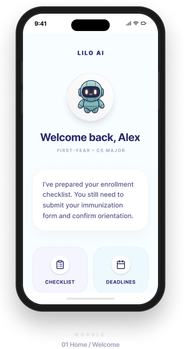
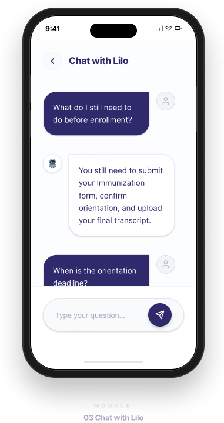

# Lilo Chatbot 项目案例
**AI 产品思维｜人机交互｜对话式系统｜用户研究**

> 本仓库是我围绕 **Lilo 大学入学咨询聊天机器人** 所整理的作品集项目案例，重点展示我在 **AI 产品分析、用户研究、人机交互设计、对话式体验分析与产品优化思考** 等方面的能力。  
> 本项目用于作品集展示与案例表达，并非官方生产代码仓库。

---

## 一、项目背景

Lilo 是一个面向大学录取后学生的短信式聊天机器人，目标是帮助学生顺利完成入学前的关键流程，并减少 “summer melt” 现象，也就是学生虽然已经被大学录取，但最终因为流程复杂、信息不清、支持不足或行动中断而未能顺利入学。

在传统入学支持流程中，学生往往需要自己在网页、邮件、表格和不同部门的信息之间来回切换，才能拼凑出完整路径。这种方式默认用户知道自己要找什么、去哪里找、如何判断优先级，但真实情况往往并不是这样。

因此，Lilo 这样的产品价值不只是“把信息做成聊天形式”，而是试图用更自然、更低门槛的方式，为处在关键过渡阶段的学生提供持续支持。

---

## 二、我的角色

在这个项目案例中，我主要从 **产品分析与人机交互** 的视角进行整理与拆解，重点包括：

- 梳理项目的目标用户、核心场景与产品定位
- 分析用户在入学阶段的主要任务与障碍点
- 从对话式交互的角度理解产品价值与体验挑战
- 从 AI 系统能力的角度思考其背后的逻辑与边界
- 结合用户体验与产品思维，提出可能的优化方向
- 将项目整理为适合作品集展示的 GitHub 案例

我希望通过这个项目体现的，不只是“我了解一个聊天机器人”，而是：

**我能够从真实用户问题出发，分析一个 AI 产品为什么存在、解决什么问题、如何优化体验。**

---

## 三、用户痛点

### 1. 信息很多，但用户并不知道从哪里开始
大学入学往往涉及多个环节，例如材料提交、时间节点确认、账户激活、表格填写和流程跟进。问题不一定在于学校没有信息，而在于信息分散、表达方式复杂、入口不统一，导致用户很难快速判断自己当前最该做什么。

### 2. 用户的问题往往不是标准问题
真实用户不会总是清晰地提问，他们更常见的表达可能是：

- “我现在要做什么？”
- “这个是不是已经过了？”
- “我找不到那个表格。”
- “我还差什么？”
- “我有点慌，不知道怎么办。”

这些输入背后往往混合了信息不清、任务状态模糊和情绪压力，而不是单纯的信息查询。

### 3. 知道信息不等于能采取行动
很多时候，用户并不是完全不知道，而是：
- 不确定优先级
- 不知道下一步去哪里
- 害怕做错
- 因为流程复杂而拖延

也就是说，产品不能只“提供答案”，还需要帮助用户把信息转化成行动。

### 4. 高风险场景下，信任非常重要
入学流程中的信息如果出错，可能直接影响用户结果。因此，系统必须在表达清晰、信息准确和体验自然之间找到平衡，避免模糊、空泛或让人误解的回复。

---

## 四、产品目标

从这个项目的使用场景来看，我认为它的核心目标包括：

### 1. 降低信息理解成本
通过更自然的交互入口，减少用户在复杂流程中自行检索信息的负担。

### 2. 帮助用户判断当前阶段与优先任务
让用户不仅获得信息，还能理解“我现在最需要完成什么”。

### 3. 推动用户完成下一步行动
把“知道信息”进一步转化为“采取行动”，帮助用户真正向目标推进。

### 4. 提供更持续、更贴近用户的支持体验
相比一次性的静态信息展示，对话式系统更适合在流程中持续陪伴用户。

### 5. 在关键节点降低流失风险
通过及时提醒、清晰说明和适当引导，帮助更多学生顺利完成关键流程。

---

## 五、关键交互问题

### 1. 如何理解模糊输入
用户的问题往往不完整、不标准，系统需要具备更强的上下文理解能力，才能判断用户真正想解决什么。

### 2. 如何从“回答问题”走向“推进任务”
仅仅回答问题并不意味着用户知道下一步该做什么。更好的交互应该帮助用户继续前进，而不是停留在解释层面。

### 3. 如何建立可信赖的体验
在教育场景中，系统回复不仅要自然，还必须稳定、明确、不过度自信。用户需要感受到它是可靠的，而不是“看起来像会聊天”。

### 4. 如何处理自动化能力的边界
并不是所有问题都适合自动解决。一个成熟的系统需要知道什么时候继续澄清，什么时候建议用户寻求人工帮助。

### 5. 如何兼顾效率与情绪体验
用户在高压力阶段使用产品时，除了需要功能支持，也需要感受到清楚、安心和低负担。这些都会直接影响他们是否继续使用。

---

## 六、我的分析框架

在分析这个项目时，我主要从以下几个层面来理解它：

### 1. 用户层
先看用户是谁、处在什么阶段、面临什么任务、会因为什么而卡住。

### 2. 场景层
再看产品出现的具体场景。这个场景是否高频、是否重要、用户在这里的决策成本高不高、容错空间大不大。

### 3. 交互层
进一步分析系统如何与用户沟通，包括：
- 用户如何表达问题
- 系统如何理解意图
- 回复是否足够清晰
- 是否真正帮助用户进入下一步

### 4. 系统层
从 AI 系统能力的角度思考，它可能依赖什么样的能力支撑，例如：
- 自然语言理解
- 多轮上下文处理
- 知识调用
- 边界判断
- 人工转接机制

### 5. 体验层
最后看整体体验是否可信、低门槛、连续，是否真正服务于用户目标，而不是只完成一次对话。

这个分析框架对我来说很重要，因为它帮助我避免只从“功能有没有”来看产品，而是从“这个产品在真实场景中是否真的有用”来判断它。

---

## 七、优化建议

如果继续沿着产品与交互的方向思考，我认为这类系统还可以在以下几方面持续优化：

### 1. 更强的阶段识别能力
如果系统能够更准确地判断用户当前所处流程阶段，就能提供更有针对性的回复，而不是泛化说明。

### 2. 更好的澄清策略
当用户问题模糊时，系统不应只给出宽泛回答，而应该通过自然的追问帮助用户逐步缩小问题范围。

### 3. 更明确的任务导向回复
回复中可以更清楚地指出：
- 当前最重要的事是什么
- 下一步建议是什么
- 是否有时间风险
- 用户应该去哪里继续操作

### 4. 更顺畅的人工支持衔接
在复杂或高风险问题上，系统应更自然地引导用户联系相关人员，而不是让用户自己重新寻找路径。

### 5. 基于真实使用反馈持续优化
如果能够进一步结合高频问题、失败对话、用户中断点和常见误解，产品就能更有针对性地优化交互逻辑和信息组织方式。

---

## 八、界面展示

### 项目界面展示
<table align="center">
  <tr>
    <td align="center">
       
      首页 / 欢迎页
    </td>
    <td align="center">
       
      入学清单页
    </td>
    <td align="center">
       
      对话页面
    </td>
  </tr>
</table>

从界面与交互形式上看，Lilo 强调的是一种更轻量、更低门槛的支持方式：

- 通过熟悉的聊天形式降低使用压力
- 通过逐步对话替代复杂页面检索
- 用更直接的方式帮助用户理解与推进任务
- 让产品更接近日常沟通习惯

这类设计对于教育支持类场景尤其重要，因为用户需要的通常不是更复杂的功能，而是更清楚、更及时、更可执行的帮助。

---

## 九、视觉表达说明

在这个作品集版本中，我也整理了项目的视觉表达方式。我希望整体视觉呈现更符合教育场景下智能支持产品的气质，即：

- 清晰
- 友好
- 可接近
- 有支持感
- 不制造额外认知负担

对于对话式系统来说，视觉虽然不是唯一重点，但它会直接影响用户对产品的第一印象与信任感。尤其在面向学生用户的场景中，过于冰冷或过强技术感的视觉风格，未必有利于建立亲和力与使用意愿。

---

## 十、能力总结

通过这个项目，我希望体现的不只是“我做过一个 AI 相关案例”，而是以下几类更底层的能力：

### 1. 用户研究与场景洞察能力
能够从真实用户处境出发，识别其需求、障碍点与任务压力，而不是只站在系统功能角度思考。

### 2. 产品分析与问题拆解能力
能够把复杂场景拆解为用户问题、产品目标、交互挑战与优化空间，形成结构化理解。

### 3. 人机交互与对话体验分析能力
能够从交互方式、任务推进、信任建立、系统边界和情绪体验等角度分析产品体验。

### 4. AI 产品理解能力
能够将一个对话系统放入更完整的 AI 产品框架中思考，而不是只把它理解为“会聊天的工具”。

### 5. 方案表达与文档输出能力
能够把复杂项目整理为逻辑清晰、面向展示与沟通的案例文档，准确表达项目价值、问题定义与思考过程。

### 6. 持续优化意识
能够从用户反馈与使用过程出发，提出后续可落地的优化方向，而不是停留在表面描述。

---

## 十一、为什么这个项目对我有意义

这个项目让我更加明确，我真正感兴趣的并不是单纯展示技术能力，而是思考：

- 技术如何进入真实场景
- 系统如何服务真实用户
- 交互方式如何影响用户理解与行动
- AI 产品如何在复杂任务中建立信任和支持感

Lilo 让我看到，对话式系统在教育场景中不仅是一个技术应用，更是一个关于 **支持、引导、理解与行动** 的产品设计问题。

这也是我希望继续深入的方向：  
**设计真正能帮助用户完成目标的 AI 产品与交互体验。**

---

## 十二、联系方式

如果你对这个项目或相关方向感兴趣，欢迎与我联系：

- GitHub: [zoezhuy](https://github.com/zoezhuy)
- Email: zz3378@tc.columbia.edu
