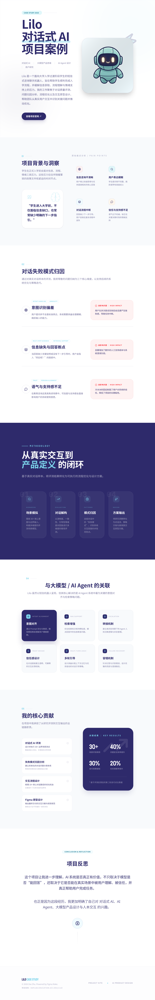

# Lilo Chatbot 项目案例
**对话式 AI｜大模型产品思维｜Agent 体验设计｜用户研究**

## 项目简介
这是一个围绕 **Lilo 大学咨询聊天机器人** 的作品集项目案例。Lilo 是一个面向学生入学阶段的短信式聊天机器人，目标是帮助学生顺利完成大学入学流程，并减少 “summer melt” 现象，也就是学生虽然已经被大学录取，但最终没有顺利入学的情况。

从 AI 产品的角度来看，Lilo 不只是一个普通问答工具，它更像是一个面向真实用户场景的 **大模型驱动对话系统**。它需要理解不同类型的用户意图，处理模糊输入，在提供信息支持的同时建立信任，并在必要时进行引导或转接。

这个仓库展示的是我基于自己在加州大学欧文分校参与 **Lilo 对话式 AI 项目** 的真实经历所整理出的项目案例。

## 项目链接
- 官方项目网站：https://daplab.education.uci.edu/lilo

## 我的角色
**产品研究助理（Lilo 对话式 AI 项目）**  
加州大学欧文分校  
2023.12 – 2024.12

在这个项目中，我主要从产品和用户体验的角度参与聊天机器人的优化工作，工作内容位于以下几个方向的交叉点：

- 对话式 AI 评测
- 大模型交互体验分析
- Agent 式用户体验设计
- 用户研究
- 产品需求转化
- 原型设计与跨团队协作

## 项目背景
学生在进入大学前，往往会同时面对两类挑战。

第一类是信息和流程上的挑战，比如：材料提交、截止日期、入学流程、学校政策等。  
第二类是情绪和社交上的挑战，比如：焦虑、不确定感、孤独感、对大学生活缺乏准备等。

Lilo 的目标就是在学生正式入学前，通过短信式对话提供支持，帮助他们更顺利地完成过渡。

但一个对话系统只有在以下方面表现良好时，才真正有价值：

- 能正确理解用户意图
- 能提供清晰、可信、相关的回应
- 能处理模糊或不完整输入
- 能在用户卡住时提供下一步引导
- 能在需要时识别转人工或升级支持的时机

因此，这个项目不仅是一个聊天机器人项目，也和今天很多 **AI Agent / LLM 应用** 的设计逻辑高度相关。

## 我的目标
我在这个项目中的核心目标，是帮助团队从真实用户交互的角度识别聊天体验中的问题，理解这些问题为什么发生，并将这些发现进一步转化为可以推动产品优化的设计方向和需求建议。

## 与 AI Agent / 大模型的关联
虽然 Lilo 的形式是聊天机器人，但它背后的很多产品问题，其实和今天的大模型应用、AI Agent 设计有很强的共通性，例如：

- 如何识别多样化的用户意图
- 如何处理模糊表达和信息缺失
- 如何决定系统应该直接回答，还是先澄清问题
- 如何让系统在语气、逻辑和回应路径上建立信任
- 如何在系统无法有效解决问题时进行升级或转接
- 如何通过检索支持、知识组织和流程设计提升回答质量

因此，这个项目也强化了我对以下方向的理解：

- 大模型驱动产品的用户体验设计
- 对话式 AI 的评测方法
- 多轮交互与任务引导逻辑
- 类 RAG / 检索支持型系统在实际产品中的价值
- AI 系统中信任感、边界感和失败兜底机制的重要性

## 我的主要贡献

### 1. 对话式 AI 评测
我设计并执行了 **30+ 个常见用户意图与边界场景** 的测试，覆盖了：

- 信息咨询类问题
- 信息缺失或表达不完整的情况
- 模糊输入和高歧义问题
- 多轮对话中的断点
- 对语气和信任感较敏感的交互场景
- 需要进一步引导、澄清或转接的情况

通过这些测试，我系统性地观察了聊天机器人在不同场景下的表现，并识别出影响用户理解与信任的关键问题。

### 2. 失败模式分析
我将对话问题归纳为一套更结构化的分类方式，包括：

- 意图识别偏差
- 信息不完整或回答缺失
- 对话流程中断
- 回应与用户真实需求不匹配
- 语气不一致或支持感不足
- 引导不足，导致用户不知道下一步怎么做

这个过程帮助团队把零散的问题观察，转化为更容易优先级排序和推动优化的产品洞察。

### 3. 将问题转化为产品需求
我的工作不只是指出“哪里有问题”，而是进一步回答：

- 用户当时想完成什么
- 系统在哪一步没有支持到位
- 这个问题为什么会影响体验
- 哪些地方应该优先优化
- 可以如何转化为具体的产品改进建议

这使得评测结果更容易被产品、设计和开发团队使用。

### 4. 绘制对话流程图
我制作了对话流程图，用来梳理：

- 用户可能的对话路径
- 容易产生摩擦的关键节点
- 回答逻辑中的空缺
- 应该增加澄清、引导或升级支持的地方

这些流程图帮助团队更直观地理解用户体验问题，也让后续讨论更高效。

### 5. 制作交互原型
我使用 Figma 制作了交互原型，将抽象的问题和优化建议转化成更具体、可沟通的界面与流程方案。

这些原型有助于：

- 更快对齐设计方向
- 支持跨团队讨论
- 提升从研究发现到产品迭代之间的沟通效率

## 我的工作流程

### 第一步：理解产品目标与用户场景
我先了解 Lilo 的产品定位、目标用户和使用场景，明确它不仅仅是在回答入学问题，也在帮助学生度过进入大学前的焦虑和不确定阶段。

### 第二步：搭建测试场景
我基于学生真实可能提出的问题，以及一些边界和异常输入，设计测试场景，用来检验系统在理想情况以外的表现。

### 第三步：评估对话质量
我重点关注以下几个维度：

- 回答是否清晰
- 回答是否有帮助
- 回答是否真正回应了用户问题
- 流程是否顺畅
- 语气是否建立信任感
- 用户是否知道下一步该做什么

### 第四步：总结失败模式
我将观察到的问题整理成可复用的分类方式，帮助团队从“单个例子”上升到“可重复出现的问题模式”。

### 第五步：转化为设计与产品优化建议
最后，我把研究发现转成更清晰的流程优化建议、产品需求和原型方向，帮助团队推进后续迭代。

## 项目成果
通过这项工作，我帮助团队以更系统的方式理解聊天机器人在真实使用场景中的问题，并推动以下方面的提升：

- 更清楚地识别高频对话断点
- 更早发现影响信任和理解的问题
- 让评测结果更容易转化为产品行动
- 帮助研究、设计、产品与开发之间更高效对齐

## 能力体现
这个项目体现了我的以下能力：

- 对话式 AI 评测
- 大模型交互分析
- Agent 体验设计
- 用户研究
- 失败模式分析
- 以用户为中心的产品思维
- 对话流程设计
- Figma 原型设计
- 跨团队沟通协作

## 工具与方法
- Figma
- 对话流程图绘制
- 用户意图分析
- 边界场景测试
- 定性评测框架
- 产品需求整理
- 大模型交互体验分析

## 为什么这个项目对我重要
这个项目让我更加明确了自己对以下方向的兴趣：

- 对话式 AI
- AI Agent
- 大模型产品设计
- 面向真实用户的大模型应用体验优化
- 兼顾可用性、可信度与支持感的人本 AI 设计

它也让我进一步意识到，一个 AI 系统是否真正有价值，不只取决于模型能力本身，还取决于它是否能在真实场景中被理解、被信任、并真正帮助用户完成任务。

## 联系方式
**Zoe Zhu**  
邮箱：zz3378@tc.columbia.edu
